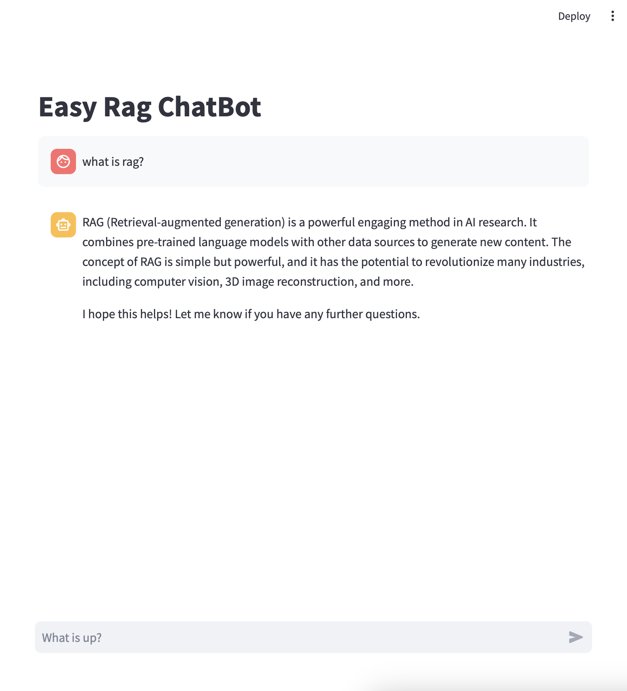

# Easy RAG

<p align="center">
 
</p>

Easy-RAG is a minimal architecture design for applying rag in llm chatbot.

Serve chatbot with RAG in your local. 

## Installation

```bash
git clone https://github.com/Sangdo-Han/research
cd research/llm/rag
sh download_model.sh # llama-cpp pretrian
conda create -n easyRAG python=3.10
conda activate easyRAG
pip install -r requirements.txt
```

## Usage
### 1. Vector Index
To run a localhost chromadb server.   
```sh
python vector_index.py --exec run --port 8000 --db_path ./vector_store --detach
```  
To kill the chromadb server.
```sh
python vector_index.py --exec stop --port 8000 
```  

### 2. Webpage Document Ingestion
```sh
python scripts/add_document.py --chromadb localhost:8000 --doc-url {url-of-document(s)} 
```

### 3. Chatbot Service with RAG

```bash
streamlit run easy_rag.py
```

<p align="center">
 
</p>

## About License
In this project, we will mainly use 4 open-sources : service-framework, llm, vectorstore and frontend.   
For llm, we used pretrained llama-2 (cpp) model from [huggingface/TheBloke](https://huggingface.co/TheBloke/Llama-2-7B-Chat-GGUF). Under the commercial-open license from Meta and TheBloke, currently academic and commercial-using is fine, however, it could be changed in the future. For the vectorstore, we used chromadb, which is open-source vector database under Apache 2.0 license. For the framework, we used langchain, which is open-source framework under MIT license. Finally, for the frontend, streamlit is used under Apache 2.0 license.

## Author
sanhan
